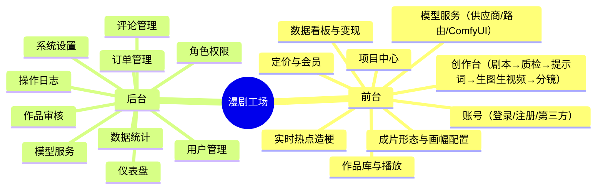

# 漫剧工场 REELMANGA · 产品设计文档（PRD）

> 版本：v2.0 · 定位：AI 一键生成短剧的 SaaS 平台
> 覆盖：真人短剧 / 漫剧 / 动漫 / 图文动态；画幅可配置（16:9 / 9:16 / 3:4 / 21:9 / 1:1 / 4:3）

---

## 目录

1. [产品概述](#1-产品概述)
2. [用户角色与画像](#2-用户角色与画像)
3. [功能全景图](#3-功能全景图)
4. [核心用户旅程](#4-核心用户旅程)
5. [功能详细设计](#5-功能详细设计)
6. [模型服务与 ComfyUI 自部署关联](#6-模型服务与-comfyui-自部署关联)
7. [非功能需求](#7-非功能需求)
8. [数据埋点与指标体系](#8-数据埋点与指标体系)
9. [迭代计划](#9-迭代计划)
10. [附录](#10-附录)

---

## 1. 产品概述

### 1.1 一句话定位

**一句话，一键生成可发布的短剧**——用户输入或导入剧本，系统自动完成多 Agent 质检、提示词生成、人物/场景生成、配音合成与分镜成片，支持多成片形态、多画幅，一键分发多平台变现。

### 1.2 解决的核心问题

| 痛点 | 解决方案 |
|------|---------|
| 短剧制作门槛高、周期长 | 多 Agent 流水线，全程无感自动生成 |
| 画风/角色一致性难 | 角色一致性引擎 + 参考图锁定 |
| 不懂提示词 | 提示词自动生成 + 校验 |
| 多平台重复制作 | 一键分发，按平台自动适配画幅 |
| AI 模型选型复杂 | 能力路由，LLM/生图/生视频/配音解耦，支持自部署 ComfyUI |

### 1.3 产品边界

- **做**：AI 短剧的生成、编辑、发布、数据、变现全流程。
- **不做（一期）**：专业级剪辑轨道、真人实拍设备接入、自有广告联盟。

---

## 2. 用户角色与画像

| 角色 | 画像 | 核心诉求 |
|------|------|---------|
| 普通用户 | 看剧、追剧、点赞 | 发现好剧、流畅观看 |
| 创作者 | 个人/小团队，想做短剧变现 | 快速出片、低成本、一键发布 |
| 工作室/MCN | 批量生产、多账号矩阵 | 批量生成、团队协作、数据看板 |
| 管理员 | 平台运营 | 用户/内容/订单/模型管理 |
| 审核员 | 内容合规 | 高效审核、违规处置 |
| 财务 | 结算 | 订单、退款、分成 |

---

## 3. 功能全景图



---

## 4. 核心用户旅程

### 4.1 一键生成旅程（核心）

1. 用户进入创作台，**写剧本**（AI 帮写）或**导入剧本**。
2. 选择**成片形态**（真人短剧/漫剧/动漫/图文动态）与**画幅**（默认 9:16）。
3. 点击「一键运行流水线」：
   - 5 个 Agent 并行质检剧本 → 自动定稿
   - 生成逐镜视频提示词 → 校验
   - 生成人物/场景（生图）→ 生视频 → 配音
   - 合成分镜成片
4. 用户**预览/微调**（改台词、换角色、切画幅）。
5. **一键发布**到抖音/快手/视频号/B站，自动适配各平台画幅。
6. 数据看板查看播放/收益。

### 4.2 热点造梗旅程

1. 首页「实时热点」查看抖音/微博近 3 小时最高热度。
2. 点「一键造梗」→ 热点写入创作灵感。
3. AI 生成大纲 → 进入完整生成流水线。

### 4.3 模型配置旅程

1. 进入「模型服务」，添加供应商：官方 / 中转站 / **自部署 ComfyUI**。
2. 配置能力（LLM/生图/生视频/配音）+ Key/地址 + 模型。
3. 「能力路由」把每个能力绑定到指定供应商。
4. 测试连接，保存，创作台即按路由调用。

---

## 5. 功能详细设计

### 5.1 账号与权限

- **注册**：手机号 + 验证码 + 密码；第三方（微信/手机/Apple/Google）。
- **登录**：账号密码 / 验证码 / 第三方；记住我、忘记密码。
- **用户体系**：普通用户 / 创作者 / Pro 会员 / 工作室（等级影响生成次数与导出权限）。
- **后台 RBAC**：超级管理员/运营/审核员/财务/只读访客，细粒度权限。

### 5.2 项目中心

- 项目卡片：封面、标题、题材、状态（草稿/渲染中/已完成/已发布）、集数、播放/收益、更新时间。
- 操作：新建、继续创作、删除、数据跳转。
- 支持按状态/题材筛选与搜索。

### 5.3 创作台（核心）

**流程阶段（对应 Agent 流水线）**

| 阶段 | 说明 |
|------|------|
| 1 剧本输入 | AI 写剧本（灵感→大纲→正文）/ 导入 .txt/.docx/.md |
| 2 Agent 剧本质检 | 逻辑 / 节奏 / 人物 / 台词 / 合规 5 类并行检查，输出评分与修复 |
| 3 剧本定稿 | 原稿 vs 定稿对比 + 改动摘要 |
| 4 提示词生成 | 逐镜提示词（画面/镜头/角色/情绪/时长） |
| 5 提示词校验 | 一致性/风格/安全/可生成性 |
| 6 人物场景生成 | 角色设定图 + 场景图 |
| 7 分镜台 | 时间轴、逐镜编辑、播放成片、导出/发布 |

**分镜编辑**：台词、角色、情绪、镜头、时长可改，实时预览。
**成片形态**：真人短剧/漫剧/动漫/图文动态（决定模型与风格）。
**画幅**：16:9 / 9:16 / 3:4 / 21:9 / 1:1 / 4:3 可切换，画布与构图自适应。

### 5.4 作品库与播放

- 竖屏/横屏卡片网格，题材筛选 + 搜索。
- 播放器：进度、倍速、点赞/收藏/评论/分享/下载；多画幅自适应。

### 5.5 实时热点（造梗）

- 数据源：抖音 + 微博热榜。
- 更新频率：每小时；只展示近 3 小时最高热度前 N 条。
- 展示：排名、热词、来源、热度值、趋势、时间、一键造梗。
- 筛选：全部/抖音/微博。

### 5.6 数据看板与变现

- 指标：累计播放、收益、粉丝、完播率、付费转化率。
- 趋势图（播放/收益）、平台分发状态、收益构成（广告分成/付费解锁/打赏/会员）。

### 5.7 定价与会员

| 方案 | 价格 | 权益 |
|------|------|------|
| 免费版 | ¥0 | 每月 3 次生成、720P |
| 创作者 Pro | ¥99/月 | 120 次生成、4K 无水印、全 Agent、数据看板、商用授权 |
| 工作室 Studio | ¥499/月 | 不限量、团队协作、自定义 Agent、API 接入、专属模型 |

### 5.8 后台管理（admin.html 十模块）

仪表盘、用户管理（增删改查/封禁/重置密码）、作品审核（通过/驳回/上下架）、评论管理、订单管理（详情/退款）、模型服务（平台级路由）、数据统计、角色权限（RBAC）、系统设置（站点/审核/安全/支付）、操作日志。

---

## 6. 模型服务与 ComfyUI 自部署关联

### 6.1 供应商体系

| 类型 | 供应商 | 能力 |
|------|--------|------|
| LLM | DeepSeek / OpenAI / Claude / Gemini / 通义 / 智谱 / Kimi / 豆包 / MiniMax / 阶跃 / 中转站 | 对话 |
| 生图 | GPT-Image / 通义万相 / 智谱 CogView / 即梦 / 可灵 / FLUX / **ComfyUI** | 生图 |
| 生视频 | Sora / 可灵 / 即梦 / Runway / MiniMax / 豆包 / **ComfyUI** | 生视频 |
| 配音 | OpenAI TTS / MiniMax / 豆包 / 通义 | TTS |

### 6.2 ComfyUI 自部署关联（专项）

**目标**：用户可将**自己部署的 ComfyUI** 作为一个「第三方模型服务」接入，用于生图/生视频，降低长期成本、保护私有模型/LoRA。

**接入流程**

```
1. 部署 ComfyUI（含所需 custom nodes：文生图/图生图/AnimateDiff/SVD 等）
2. 在「模型服务」添加供应商：类型=自部署，填服务地址（可多实例）
3. 配置能力（生图/生视频），上传/选择工作流模板（JSON API 格式）
4. 测试连接（提交一次空跑或极小尺寸工作流）
5. 保存 → 能力路由把「生图/生视频」绑定到该 ComfyUI
```

**参数映射**

| 产品参数 | ComfyUI 参数 |
|---------|-------------|
| 正向/负向提示词 | `positive / negative` 节点输入 |
| 画幅（aspect_ratio） | 计算 `width × height`（如 9:16→576×1024，16:9→1024×576，21:9→1344×576） |
| 风格/成片形态 | 选择模型/checkpoint、LoRA、采样器、CFG、steps |
| 种子 | `seed`（-1 随机，固定保证一致性） |
| 参考图（图生图/角色一致） | `/upload` 上传 + LoadImage 节点 |

**工作流模板管理**
- 模板存储：把 workflow 的 API 格式 JSON 存到 `model_provider`，参数用占位符。
- 版本化：模板可多版本，灰度切换，回滚。
- 校验：保存前校验节点结构、缺失节点（如未装 AnimateDiff 则禁用生视频能力）。

**多实例与负载**
- 支持多个 ComfyUI 地址（`http://ip:8188`）。
- Worker 按实例健康状态与队列深度选择；GPU 满时排队，超时告警。
- 公网暴露需加鉴权反代（如 Nginx Basic Auth + HTTPS），内网/专线优先。

**安全与计量**
- 地址仅服务端可见，前端只显示 `http://***` 打码。
- 生图/生视频按「次数 + 尺寸 + 时长」计量计费（自部署可计 0 或低费率）。
- 记录每次任务的工作流、参数、耗时、结果，便于审计与成本核算。

### 6.3 能力路由

- 用户级 > 平台级；每个能力（剧本 LLM / 质检 Agent / 生图 / 生视频 / 配音）独立绑定。
- 失败自动降级：首选失败 → 备用供应商/中转站/ComfyUI。

---

## 7. 非功能需求

| 类别 | 需求 |
|------|------|
| 性能 | 业务接口 P95<200ms；生成任务异步，进度实时推送 |
| 可用性 | 核心链路 ≥99.9%，可灰度、可回滚 |
| 并发 | 支持 500/3000/5000 同时在线，按服务横向扩容 |
| 安全 | Key 加密、多租户隔离、内容合规、审计 |
| 兼容 | 移动端/桌面自适应；主流浏览器 |
| 可观测 | 全链路 traceId、指标告警 |

---

## 8. 数据埋点与指标体系

| 维度 | 指标 |
|------|------|
| 增长 | 注册数、DAU/MAU、留存、创作者数 |
| 创作 | 生成任务数、成功率、平均耗时、人均生成次数 |
| 消费 | 播放量、完播率、点赞/收藏/评论、分享 |
| 变现 | 付费转化率、ARPU、订单、退款率、各分成占比 |
| 模型 | 各供应商调用量/成功率/延迟/成本、ComfyUI 队列深度与 GPU 利用率 |

---

## 9. 迭代计划

| 版本 | 内容 | 目标 |
|------|------|------|
| MVP（V1.0） | 账号、项目、创作台流水线、模型服务（含 ComfyUI）、作品库、后台基础 | 跑通生成闭环 |
| V1.1 | 实时热点、数据看板、一键发布、定价会员 | 变现闭环 |
| V1.2 | 团队协作、批量生成、自定义 Agent 编排 | 工作室规模 |
| V2.0 | 开放 API、插件市场（工作流/LoRA）、自建 GPU 调度 | 生态化 |

---

## 10. 附录

### 10.1 术语

| 术语 | 说明 |
|------|------|
| 成片形态 content_type | 真人短剧 / 漫剧 / 动漫 / 图文动态 |
| 画幅 aspect_ratio | 16:9 / 9:16 / 3:4 / 21:9 / 1:1 / 4:3 |
| 能力路由 | 把「剧本/生图/生视频/配音」绑定到指定供应商 |
| 供应商类型 | 官方 / 中转站 / 自部署(ComfyUI) |
| Agent 流水线 | 多 Agent 协作自动生成短剧的编排链路 |

### 10.2 作品状态机

```
草稿 → 渲染中 → 已完成 → 审核中 → 已上架 ⇄ 已下架 / 违规下架
```

### 10.3 生成任务状态机

```
PENDING → RUNNING → SUCCESS / FAILED / PARTIAL(可重跑) → DONE
```

---

> **总结**：本产品以「多 Agent 无感生成」为核心，以「成片形态 × 画幅 × 能力路由」为可配置三维，并把**自部署 ComfyUI** 纳入第三方模型服务体系，兼顾开箱即用（云 API）与长期成本可控（自建 GPU），形成完整可商用的短剧生成闭环。
