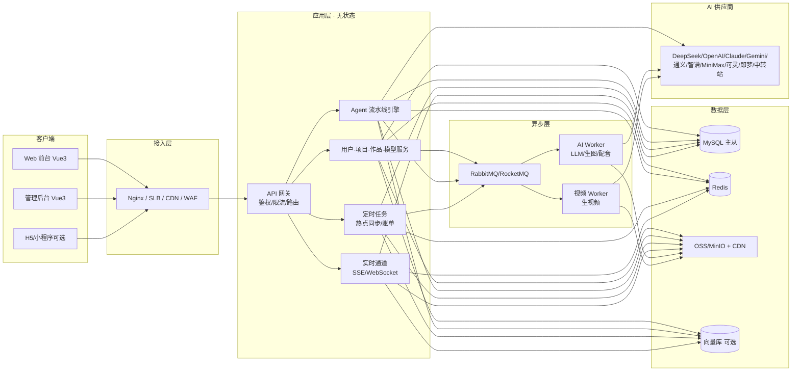
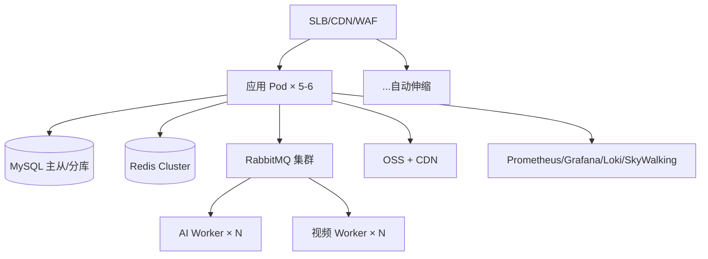

# 漫剧工场 REELMANGA · 开发架构文档

> 技术栈：**Vue 3 + Spring Boot 3 + Spring AI 2.0**
> 范围：完整覆盖现有 `index.html`（前台）与 `admin.html`（后台）原型功能，并面向可扩展、可商用的生产级实现。
> 版本：v1.0 · 目标：MVP 可商用 + 支持 500 / 3000 / 5000 同时在线平滑扩容。

---

## 目录

1. [项目概述](#1-项目概述)
2. [功能范围（对应现有原型）](#2-功能范围)
3. [技术选型](#3-技术选型)
4. [总体架构](#4-总体架构)
5. [前端架构](#5-前端架构)
6. [后端架构](#6-后端架构)
7. [核心模块详细设计](#7-核心模块详细设计)
8. [数据库设计](#8-数据库设计)
9. [接口与通信规范](#9-接口与通信规范)
10. [并发与高可用设计](#10-并发与高可用设计)
11. [容量规划与服务器配置（500/3000/5000）](#11-容量规划与服务器配置)
12. [安全设计](#12-安全设计)
13. [可观测性](#13-可观测性)
14. [部署方案与 CI/CD](#14-部署方案与-cicd)
15. [开发里程碑与排期](#15-开发里程碑与排期)
16. [风险与应对](#16-风险与应对)
17. [附录](#17-附录)

---

## 1. 项目概述

「漫剧工场 REELMANGA」是一款 **AI 一键生成短剧** 的 SaaS 平台，支持 **真人短剧 / 漫剧 / 动漫 / 图文动态** 等多种成片形态。用户写/导入剧本，经多 Agent 自动质检定稿、生成视频提示词、生成人物/场景、合成配音，最终产出可发布的短剧成片，并支持多平台分发与变现。**画幅比例可配置**（16:9 / 9:16 / 3:4 / 21:9 / 1:1 / 4:3 等市面常用比例）。

核心商业闭环：**创意 → 无感生成 → 发布 → 变现**。

### 1.1 架构目标

| 维度 | 目标 |
|------|------|
| 商用 | 多租户（按用户隔离）、按量计费、API Key 私有化、内容合规、多成片形态、多画幅可配置 |
| 可用性 | 核心链路可用性 ≥ 99.9%，可灰度、可回滚 |
| 性能 | 业务接口 P95 < 200ms；AI 生成走异步不阻塞请求 |
| 扩展 | 500 → 5000 在线只需横向加节点，无需改代码 |
| 可维护 | 模块化单体起步，按需拆服务，统一可观测 |

---

## 2. 功能范围

### 2.1 前台（对应 index.html）

| 模块 | 功能 |
|------|------|
| 账号 | 注册/登录/第三方登录/会话持久化 |
| 项目中心 | 项目 CRUD、状态流转（草稿/渲染中/已完成/已发布） |
| 创作台 | 剧本 AI 写作/导入 → 多 Agent 质检 → 定稿 → 提示词生成 → 提示词校验 → 人物/场景生成 → 分镜台（可编辑/播放，**画幅比例可配置**） |
| 模型服务 | 供应商预设、能力矩阵（LLM/生图/生视频/配音）、能力路由、连通测试、Key 打码 |
| 作品库 | 列表/筛选/播放器 |
| 数据看板 | 播放、收益、粉丝、平台分发 |
| 实时热点 | 抖音/微博热榜聚合、1 小时更新、近 3 小时最高热度、一键造梗 |
| 其它 | 风格引擎、定价 |

### 2.2 后台（对应 admin.html）

仪表盘、用户管理、作品审核、评论管理、订单管理、模型服务（平台级路由）、数据统计、角色权限（RBAC）、系统设置、操作日志、登录屏。

---

### 2.3 成片形态与画幅比例（可配置）

**成片形态**（`content_type`，决定生成管线走向）：

| 成片形态 | 说明 | 典型画幅 |
|---------|------|---------|
| 真人短剧 | AI 数字人 / 真人实拍 + AI 后期 | 9:16 / 16:9 |
| 漫剧 | 漫画分镜动态化 + 配音 | 9:16 / 3:4 |
| 动漫 | 2D / 3D 动画短片 | 16:9 / 21:9 |
| 图文动态 | 图片 + 文字 + 配音轮播 | 3:4 / 1:1 |

**画幅比例**（`aspect_ratio`，可配置枚举）：

| 比例 | 用途 |
|------|------|
| `16:9` | 横屏长视频、西瓜/B站/影视 |
| `9:16` | 竖屏短视频、抖音/快手/视频号 |
| `3:4` | 信息流、小红书、竖屏封面 |
| `21:9` | 宽银幕、电影感 |
| `1:1` | 方形、主页/电商 |
| `4:3` | 兼容旧端/平铺 |

- 画幅是**项目级配置**，贯穿：分镜构图 → 生图/生视频参数 → 前端预览画布 → 导出与平台发布。
- 生图/生视频接口透传 `aspect_ratio`；供应商不直接支持的比例，采用「生成后智能裁切」兜底。

## 3. 技术选型

| 层 | 选型 | 版本 | 说明 |
|----|------|------|------|
| 语言 | Java / TypeScript | JDK 21 / TS 5.x | 均为 LTS |
| 后端框架 | Spring Boot | 3.4.x+ | 与 Spring AI 2.0 配套 |
| AI 框架 | Spring AI | 2.0.x | 统一 Chat / Image / Audio / 结构化输出 |
| Web 框架 | Vue 3 + Vite | 3.5+ / 6.x | 组合式 API + `<script setup>` |
| 状态管理 | Pinia | 2.x/3.x | 用户态、项目态、模型路由 |
| 路由 | Vue Router | 4.x | 前台/后台两套路由 |
| UI 组件库 | Element Plus 或 Naive UI | 最新 | 主题定制对齐现有深色设计 |
| 图表 | ECharts | 5.x | 数据看板 |
| 持久层 | MyBatis-Plus | 3.5.x | 单表 CRUD 高效 |
| 数据库 | MySQL | 8.0 | 业务主库 |
| 缓存 | Redis | 7.x | 会话/热点/榜单/限流/分布式锁 |
| 消息队列 | RabbitMQ 或 RocketMQ | 3.x/5.x | 异步任务解耦（国内可优先 RocketMQ） |
| 对象存储 | MinIO / 阿里云 OSS | — | 素材、成片 |
| 向量库 | pgvector / Milvus | — | 剧本/热点语义检索（二期） |
| 网关 | Nginx / SLB / Spring Cloud Gateway | — | 静态资源、反向代理、限流 |
| 容器 | Docker / K8s | — | 起步 Compose，规模化 K8s |
| 可观测 | Prometheus + Grafana + Loki + SkyWalking | — | 指标/日志/链路 |
| 限流熔断 | Sentinel 或 Resilience4j | — | 网关与任务级限流 |
| 安全 | Spring Security + JWT | — | 认证/授权 |

> **为何 Spring AI 2.0**：它原生提供 `ChatModel / ImageModel / AudioModel / EmbeddingModel` 抽象，内置 OpenAI、Anthropic、Google、DeepSeek、通义、智谱、MiniMax 等适配器，且支持自定义 `base-url`，**天然兼容“中转站 / OpenAI 兼容”**，正好匹配「模型服务」的 LLM/生图/配音路由需求。生视频（可灵/即梦/Runway/Sora）Spring AI 无官方抽象，需自定义 `VideoClient`（见 7.5）。

---

## 4. 总体架构

### 4.1 架构图



**设计原则**
- **模块化单体优先**：前期一个 Spring Boot 应用承载业务模块，减少网络开销与运维成本；异步 AI 任务用 MQ 拆到独立 Worker（可独立扩容）。
- **无状态 + 水平扩展**：会话放 Redis，文件放 OSS，应用不落盘状态。
- **演进路径**：当单模块成为瓶颈（如 AI 编排、结算），再拆独立服务。

### 4.2 请求分层

1. **接入层**：Nginx 做 HTTPS、静态资源、反向代理、WAF。
2. **网关/鉴权**：JWT 校验、RBAC 权限、限流、幂等键。
3. **业务层**：同步业务直接返回；长耗时（AI 生成）投递 MQ 返回 `taskId`。
4. **异步层**：Worker 消费任务，调用 Spring AI 多供应商，结果写 OSS + DB。
5. **实时通知**：任务进度通过 SSE/WebSocket 推给前端（对应“用户无感”的进度展示）。

---

## 5. 前端架构

### 5.1 目录结构

```
web/
├── src/
│   ├── main.ts
│   ├── App.vue
│   ├── router/                 # 前台路由 + 后台路由(懒加载)
│   ├── stores/                 # Pinia: auth / project / pipeline / models / trends
│   ├── api/                    # axios 封装 + 接口模块
│   ├── components/             # 通用组件(ReelCard/FramePlayer/AgentCard...)
│   ├── views/
│   │   ├── front/              # 首页/项目/创作台/作品库/数据/模型服务/定价
│   │   └── admin/              # 仪表盘/用户/作品/评论/订单/模型/角色/设置/日志
│   ├── composables/            # useSSE/useCountdown/usePolling
│   └── styles/                 # 设计令牌(colors/typography/spacing)
├── vite.config.ts
└── package.json
```

### 5.2 页面 → 路由映射（与原型一致）

| 前台路由 | 视图 | 后台路由 | 视图 |
|---|---|---|---|
| `/` | 首页（含实时热点） | `/admin/login` | 登录屏 |
| `/projects` | 项目中心 | `/admin` | 仪表盘 |
| `/studio/:id` | 创作台（流水线） | `/admin/users` | 用户管理 |
| `/gallery` | 作品库 | `/admin/works` | 作品审核 |
| `/data` | 数据看板 | `/admin/comments` | 评论管理 |
| `/models` | 模型服务 | `/admin/orders` | 订单管理 |
| `/pricing` | 定价 | `/admin/models` | 模型服务 |
| `/auth` | 登录/注册 | `/admin/roles`、`/admin/settings`、`/admin/logs` | 权限/设置/日志 |

### 5.3 关键状态与实时

- **Pinia**：`authStore`（JWT+刷新）、`pipelineStore`（任务进度/分镜数据）、`modelsStore`（供应商/路由）。
- **实时**：创作台进度用 **SSE**（`/api/tasks/{id}/stream`），热榜用轮询（60s）+ 本地倒计时。
- **播放器/分镜**：复用原型的多画幅帧渲染逻辑（9:16 / 16:9 / 3:4 / 21:9 / 1:1 可配置），素材 URL 从后端 OSS 返回。

---

## 6. 后端架构

### 6.1 分层（模块化单体 · Maven 多模块）

```
reelmanga-server/
├── reelmanga-common/          # 通用：响应体/异常/工具/枚举
├── reelmanga-auth/            # 认证、RBAC
├── reelmanga-user/            # 用户、会员、订单
├── reelmanga-project/         # 项目、剧本、分镜、作品
├── reelmanga-agent/           # Agent 流水线编排 + 提示词
├── reelmanga-ai/              # Spring AI 供应商抽象 + 生图/生视频/配音客户端
├── reelmanga-content/         # 评论、审核、实时热点
├── reelmanga-analytics/       # 数据统计、结算
├── reelmanga-admin/           # 后台管理接口
├── reelmanga-task/            # 异步 Worker（可独立部署）
└── reelmanga-bootstrap/       # 启动装配、配置
```

### 6.2 包结构（以 agent 模块为例）

```
com.reelmanga.agent
├── controller/     # 任务提交/进度查询
├── service/        # 编排服务 PipelineService
├── orchestrator/   # Stage 链、DAG、状态机
├── stage/          # ReviewStage / PromptStage / ImageStage / VideoStage / TtsStage
├── prompt/         # 提示词模板 + 结构化输出 Schema
├── repository/     # task / task_step 表
└── config/         # 线程池、重试策略
```

---

## 7. 核心模块详细设计

### 7.1 认证与权限（RBAC）

- 登录：手机号/邮箱 + 密码，JWT（`accessToken` 30min + `refreshToken` 7d），Redis 存刷新令牌。
- 权限：`user → role → permission`，`@PreAuthorize("hasAuthority('work:review')")`。
- 后台：单独 `admin` 角色体系（与前台同库不同表或同一 RBAC 表），对应 `admin.html` 的角色权限页。
- 验证码：图形/短信（接云短信），接口限流防刷。

### 7.2 模型服务与能力路由（Spring AI 多供应商）

**数据模型**

| 字段 | 说明 |
|---|---|
| provider_id | 供应商（deepseek/openai/自定义中转） |
| base_url | 支持中转站（OpenAI 兼容） |
| api_key | **AES-GCM 加密存储**，仅服务端可解 |
| caps | `{llm,image,video,tts}` 能力位 |
| models | 各能力对应模型名 |

**抽象实现（对应原型“能力路由”）**

```java
// 统一编排入口，按能力路由到具体供应商
public interface AiGateway {
    String chat(RouteKey route, ChatRequest req);      // LLM
    String image(RouteKey route, ImageRequest req);    // 生图
    String tts(RouteKey route, TtsRequest req);        // 配音
    VideoTask video(RouteKey route, VideoRequest req); // 生视频(异步)
}
```

- `RouteKey` = `(userId, capability)`：优先取用户私有配置，否则用平台默认路由（对应后台“平台级路由”）。
- 供应商适配用 Spring AI 的 `ChatModel` / `ImageModel` / `AudioModel`；中转站统一走 `OpenAiChatModel(baseUrl=中转地址)`。
- 连通测试：发 1 token 的极小请求校验 Key + 延迟，结果回写状态。

### 7.3 多 Agent 流水线（核心）

**状态机**

```
PENDING → RUNNING → (每个阶段) SUCCESS / FAILED
                ↘ PARTIAL(部分失败可重跑) → DONE
```

**编排**：`Stage` 链 + 阶段内并行 Agent（`CompletableFuture`）：

```java
List<ReviewAgent> agents = List.of(logicAgent, paceAgent, charAgent, oralAgent, safeAgent);
List<ReviewResult> results = agents.parallelStream().map(a -> a.run(script)).toList();
```

- **结构化输出**：每个 Agent 用 Spring AI `BeanOutputConverter` + JSON Schema，返回 `{issues, fixedScript, score}`，避免正则解析。
- **可观测**：`task_step` 记录每个 Agent 的 prompt、耗时、token、成本、状态（对应原型 Agent 卡片与“无感”进度）。
- **重试/降级**：Agent 失败重试 2 次，换模型降级；合规 Agent 失败则阻断发布。
- **人工介入**：`PARTIAL` 状态允许用户在前端逐镜编辑后重跑单阶段。
- **成片形态分流**：`content_type`（真人短剧 / 漫剧 / 动漫 / 图文动态）决定各阶段采用的模型与风格参数——真人短剧走数字人/实拍模型、漫剧走漫画分镜模型、动漫走动画模型；Stage 编排不变，仅替换阶段内的模型实现与提示词模板。

### 7.4 剧本 / 提示词 / 分镜

- 剧本：`script` 表存原文 + 定稿 + diff（JSON）。
- 提示词：定稿 → 逐镜提示词（`PromptStage`），每条含画面/镜头/角色/情绪/时长。
- 提示词校验：一致性/风格/安全/可生成性四类校验（规则 + LLM）。
- 分镜：`shot` 表，含 `scene_id / character_id / camera / emotion / duration / dialogue / prompt / asset_url`；另含 `aspect_ratio`（画幅）与 `content_type`（成片形态）。

### 7.5 生图 / 生视频 / 配音任务

- **生图**：`ImageModel.generate()` 时透传 `aspect_ratio`（16:9 / 9:16 / 3:4 / 21:9 / 1:1 / 4:3）→ 存 OSS → 回写 `shot.asset_url`；供应商不直接支持的比例用「生成后裁切」兜底。
- **生视频**：无统一抽象，自定义 `VideoClient`：

```java
VideoTask submit(VideoRequest req);     // 提交任务，拿远端 taskId
VideoStatus poll(String remoteTaskId);  // 轮询/回调获取进度与结果
```

可灵/即梦/Runway/Sora 都是「提交 + 轮询/回调」模式，统一封装，同样透传 `aspect_ratio`。**生视频是成本与耗时大头，必须走 MQ + 限流 + 优先级队列**。

- **配音**：`AudioModel` 或供应商 TTS 客户端，逐镜生成 → 存 OSS → 回写。
- **成片形态适配**：按 `content_type` 选择生图/生视频模型与风格参数（真人→写实数字人、漫剧→漫画风、动漫→动画风），画幅 `aspect_ratio` 同步透传。
- **素材一致性**：角色/场景生成时带 `character_id` 一致化参数（参考图/种子），对应“角色一致性”。

### 7.6 实时热点（抖音/微博）

```
@Scheduled(cron = "0 0 * * * *")   // 每小时
拉取(三方数据服务/合规爬取) → 清洗去重 → 写 hot_trends → 刷 Redis 缓存
前端: 轮询 /trends?window=3h → 只返回 3 小时且按热度排序的前 N 条
```

- 热榜数据源建议接**合规三方数据服务**（新榜/清博/蝉妈妈等），避免自建爬虫的合规与反爬风险。
- 表：`hot_trend(title, source, heat, trend, fetched_at, raw)`，按 `fetched_at >= now-3h` 过滤。
- “一键造梗”：把热词写入项目灵感字段，进入创作台。

### 7.7 作品 / 发布 / 数据

- 作品审核：状态机 `审核中 → 已上架/已下架/违规下架`，人工 + 自动（合规 Agent）。
- 发布：对接抖音/快手/视频号/B站/西瓜开放平台（各平台授权与上传接口不同，做成 `PublishChannel` 接口）；按平台偏好自动选择/裁剪画幅（抖音/快手/视频号 9:16，B站/西瓜 16:9 等）。
- 数据看板：播放/收益/粉丝/完播率，用 ECharts；离线统计（每日汇总表）避免大表实时聚合。

### 7.8 后台管理

独立路由 + 独立 RBAC；对应 `admin.html` 的 10 个模块，接口走 `/admin/**`，权限拦截。

---

## 8. 数据库设计

### 8.1 核心表（精简）

| 表 | 关键字段 | 说明 |
|----|---------|------|
| `user` | id, phone, email, password_hash, status, level | 用户 |
| `role` / `permission` / `user_role` / `role_permission` | — | RBAC |
| `project` | id, user_id, title, genre, status, cover_url | 项目 |
| `script` | project_id, original, final, diff_json | 剧本 |
| `agent_task` | id, project_id, type, status, progress, cost | 流水线任务 |
| `agent_task_step` | task_id, stage, agent, status, prompt, output, tokens, latency | 每步可观测 |
| `shot` | project_id, seq, scene_id, character_id, camera, emotion, duration, dialogue, prompt, aspect_ratio, content_type, image_url, video_url, audio_url | 分镜 |
| `asset` | user_id, type(character/scene/style), url, prompt, ref_id | 素材 |
| `model_provider` | user_id(可空=平台), provider_id, base_url, api_key_enc, caps, models | 供应商 |
| `model_route` | user_id(可空), capability, provider_id, model | 能力路由 |
| `work` | project_id, status, plays, likes, publish_time, aspect_ratio, content_type | 作品/发布 |
| `comment` | work_id, user_id, content, status | 评论 |
| `order` | no, user_id, plan, amount, status, channel | 订单 |
| `hot_trend` | title, source, heat, trend, fetched_at | 热榜 |
| `api_usage` | user_id, provider, capability, tokens, cost, at | 用量/计费 |
| `operation_log` | admin_id, module, action, ip, result, at | 操作日志 |

> 完整 DDL 在开发期细化；上表已覆盖原型全部功能实体。分片键建议 `user_id`（多租户隔离 + 水平扩展）。

---

## 9. 接口与通信规范

- **风格**：RESTful + 统一响应 `{code, message, data, traceId}`。
- **异步**：AI 任务 `POST /api/tasks` 返回 `taskId`；`GET /api/tasks/{id}` 查进度；`SSE /api/tasks/{id}/stream` 推进度（对应“无感”进度条）。
- **实时热榜**：`GET /api/trends?window=3h&source=douyin`。
- **分页**：`page/size`，大数据量用游标。
- **幂等**：任务/订单提交带 `Idempotency-Key`。
- **错误码**：业务码分段（1xxx 通用、2xxx 用户、3xxx 项目、4xxx 模型、5xxx 订单…）。

---

## 10. 并发与高可用设计

### 10.1 关键认知

- **在线 ≠ 并发**：5000 在线，同一秒真正发业务请求的通常只有 5%~10%（250~500 QPS）。
- **AI 生成是异步的**：不占 Web 线程，瓶颈在**上游 API 配额**而非服务器。
- **重头是「AI 任务队列」**：需限流、优先级、幂等、可重试。

### 10.2 高可用手段

| 手段 | 实现 |
|------|------|
| 无状态应用 | 会话/配置入 Redis，应用可任意水平扩缩 |
| 数据库 | 主从 + 读写分离，云 RDS 高可用版自动切换 |
| Redis | 哨兵/Cluster，缓存与分布式锁 |
| MQ | 集群 + 持久化 + 死信队列 |
| 网关限流 | Sentinel 令牌桶：按用户 + 按接口 + 按供应商配额 |
| 熔断降级 | 供应商不可用时降级到备用模型（DeepSeek↔中转站） |
| 灰度发布 | 版本分流，蓝绿/金丝雀 |
| 定时任务 | 分布式锁（Redisson）防重复执行 |

### 10.3 关键参数（起步参考）

- Tomcat：`max-threads=200`，`max-connections=2000`。
- HikariCP：`pool-size=20~40`（= 2×CPU 核数）。
- Redis 连接池：`max-active=64`。
- MQ 消费者并发：AI Worker 按供应商 QPS 配额设置（如生图并发 4，生视频并发 2）。

---

## 11. 容量规划与服务器配置

> 成本为**主流云厂商包年/按量**粗略估算（不含 AI 上游调用费）。AI 费用按 token/张/秒另计，是变量成本。

### 11.1 三档对比

| 指标 | 500 在线 | 3000 在线 | 5000 在线 |
|------|----------|-----------|-----------|
| 业务峰值 QPS | 50–100 | 300–500 | 500–1000 |
| WebSocket 长连接 | 500 | 3000 | 5000 |
| 应用服务器 | 2C4G × 2 | 4C8G × 3 | 4C8G/8C16G × 5–6 |
| MySQL | 2C4G 单实例 | 4C8G 主从 | 8C16G 主从 + 分库分表/云原生 |
| Redis | 2C4G | 4C8G 主从 | Cluster 3主3从 |
| 消息队列 | 与应用同机（或托管版） | 4C8G × 1 | 4C8G × 3 集群 |
| 对象存储 | OSS/MinIO | OSS/MinIO | OSS + CDN |
| 带宽 | 5–10 Mbps | 20–30 Mbps | 50–100 Mbps + CDN |
| AI Worker | 1–2 实例 | 2–4 实例 | 4–8 实例 |
| 月成本（云） | ¥300–600 | ¥3000–6000 | ¥8000–15000 |

### 11.2 500 在线（起步）

- 单台 2C4G 应用可扛，配 2 台做「主备/负载」保证可用。
- 数据库/Redis 用**云托管版**（免运维、自带高可用）。
- 建议：`2× 2C4G 应用` + `云 RDS 2C4G` + `云 Redis 2C4G` + `OSS`，月 ≈ ¥300–600。

### 11.3 3000 在线（成长）

- 应用 3 台 4C8G + SLB；MySQL 主从读写分离；Redis 主从；引入 MQ。
- AI 任务独立 2–4 个 Worker（4C8G）。
- 建议上 K8s 简化扩缩容，月 ≈ ¥3000–6000。

### 11.4 5000 在线（成熟）

- 应用 5–6 台（K8s HPA 按 CPU/QPS 自动伸缩），8C16G。
- MySQL 主从 + 分库分表（或云原生分布式库）；Redis Cluster；MQ 集群；CDN 加速素材/成片。
- AI Worker 4–8 实例，按上游供应商高并发套餐配额扩容。
- 全链路可观测 + 多可用区部署，月 ≈ ¥8000–15000。

### 11.5 带宽与存储估算

- 单张角色/场景图 1–2MB，单镜成片 2–5MB，一部 10 镜 ≈ 30–60MB。
- 5000 在线日生成 3000 部：新增存储 ≈ 100–180GB/日 → 月 ≈ 3–5TB，用 OSS+CDN 分摊（CDN 命中率 >90%）。
- 数据库 + 日志约 200–500GB/月，用归档与冷热分层。

---

## 12. 安全设计

- **密钥**：API Key AES-GCM 加密 + KMS 管理；日志/接口永不明文返回（前端打码 `sk-****`）。
- **认证**：JWT + 刷新令牌；后台二次验证（短信）。
- **内容合规**：文本/图片前置审核（合规 Agent + 三方内容安全 API），对应“合规安全 Agent”。
- **接口安全**：HTTPS、限流、幂等、防重放、CORS 白名单。
- **数据隔离**：多租户强制 `user_id` 过滤，防止越权（SQL 拦截器统一注入）。
- **审计**：后台操作日志全量留痕（`operation_log`）。

---

## 13. 可观测性

| 层 | 方案 |
|----|------|
| 指标 | Micrometer → Prometheus → Grafana（QPS/延迟/错误率/JVM/连接池） |
| 日志 | 结构化 JSON → Loki/ELK，带 `traceId` |
| 链路 | SkyWalking / OpenTelemetry，覆盖 Agent 阶段耗时 |
| 告警 | 错误率、P95、MQ 积压、供应商失败率、任务队列长度 |

**关键监控指标**：业务 QPS、P95、AI 任务成功率/平均耗时、各供应商失败率与成本、MQ 积压数、OSS/CDN 流量。

---

## 14. 部署方案与 CI/CD

### 14.1 部署拓扑（5000 在线示例）



### 14.2 环境

| 环境 | 用途 |
|------|------|
| dev | 本地 Compose（MySQL/Redis/MQ/MinIO） |
| test | 联调 + 自动化测试 |
| staging | 预发，真实 AI 供应商（低配额） |
| prod | 生产，多可用区 |

### 14.3 发布流程

```
Git push → CI(构建/单测/镜像) → 推送镜像仓库 → CD(灰度10% → 全量) → 监控确认 → 回滚(如需)
```

- 前端构建产物推 OSS+CDN 或 Nginx 静态目录。
- 数据库变更用 Flyway 版本化迁移，向后兼容。

---

## 15. 开发里程碑与排期

> 按 3 名后端 + 2 名前端估算，MVP 约 **10–12 周**。

| 阶段 | 内容 | 周期 | 交付物 |
|------|------|------|--------|
| P0 初始化 | 脚手架、CI、设计系统落地、DB 迁移框架 | 1 周 | 可运行骨架 |
| P1 账号与模型服务 | 注册/登录/RBAC、供应商/路由/Key 加密 | 2 周 | 登录+模型配置可用 |
| P2 项目与流水线 | 剧本/多 Agent 编排/提示词/分镜 | 3 周 | 一键生成闭环 |
| P3 生成任务 | 生图/生视频/配音 Worker、进度推送 | 2 周 | 真实出片 |
| P4 前台其余 | 作品库/数据/实时热点/定价 | 2 周 | 前台完整 |
| P5 后台 | 10 个后台模块 | 2 周 | 后台完整 |
| P6 测试与上线 | 性能/安全压测、灰度上线、监控 | 2 周 | 生产可用 |

**验收标准**：5000 在线压测 P95<200ms、错误率<0.1%、AI 任务 24h 无积压、数据看板与后台核对一致。

---

## 16. 风险与应对

| 风险 | 应对 |
|------|------|
| 上游 AI 供应商限流/涨价 | 多供应商路由 + 中转站冗余 + 用量缓存兜底 |
| 生视频成本高/耗时 | 优先级队列、按套餐限并发、短视频切片、自建 GPU（后期） |
| 热榜数据合规 | 优先接三方授权数据服务 |
| 内容违规 | 前置合规 Agent + 三方内容安全 + 人工复核 |
| 单点故障 | 云 RDS/Redis 高可用版 + 多可用区 + 无状态应用 |
| 越权/数据泄露 | 多租户 SQL 拦截 + Key 加密 + 审计 |

---

## 17. 附录

### 17.1 关键依赖清单（后端）

```
spring-boot-starter-web / security / validation / data-redis
spring-ai-starter-model-openai / anthropic / google / dashscope / zhipuai / minimax
mybatis-plus-spring-boot3-starter
mysql-connector-j / redisson / rabbitmq / minio
jjwt / hutool / mapstruct / flyway
micrometer-registry-prometheus / skywalking
```

### 17.2 关键环境变量示例

```env
# 应用
SPRING_PROFILES_ACTIVE=prod
# 数据库
DB_HOST=... DB_USER=... DB_PASS=...
# Redis
REDIS_HOST=... REDIS_PASS=...
# 对象存储
OSS_ENDPOINT=... OSS_AK=... OSS_SK=... OSS_BUCKET=...
# 模型供应商(加密后)
AI_DEFAULT_PROVIDER=deepseek
AI_KEY_DEEPSEEK=... AI_BASE_DEEPSEEK=https://api.deepseek.com/v1
AI_KEY_OPENAI=... AI_KEY_KLING=... AI_KEY_MINIMAX=...
# 密钥
JWT_SECRET=... AES_KEY=...
```

### 17.3 设计图 / UI 规范

前端直接还原现有原型的深色设计系统（品牌渐变、多画幅卡片 9:16/16:9/3:4/21:9、玻璃拟态、状态徽标）。将 `styles/` 设计令牌抽成 CSS 变量 + 组件库主题覆盖，保证与 Figma/原型一致。

---

> **一句话总结**：用「模块化单体 + MQ 异步 Worker + Spring AI 多供应商抽象」起步，配合无状态水平扩展与云托管数据组件，可在不推翻架构的前提下，从 500 人平滑扩到 5000 人在线；真正决定成本的变量是 AI 上游调用，因此把「能力路由 + 限流 + 用量计费」做成核心能力。
