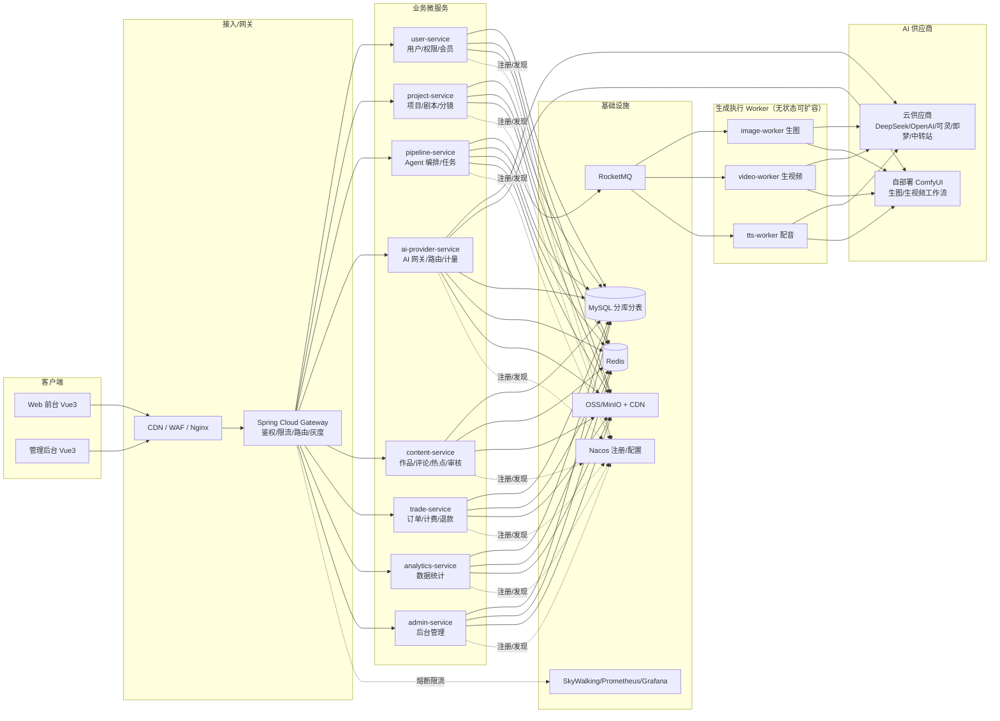
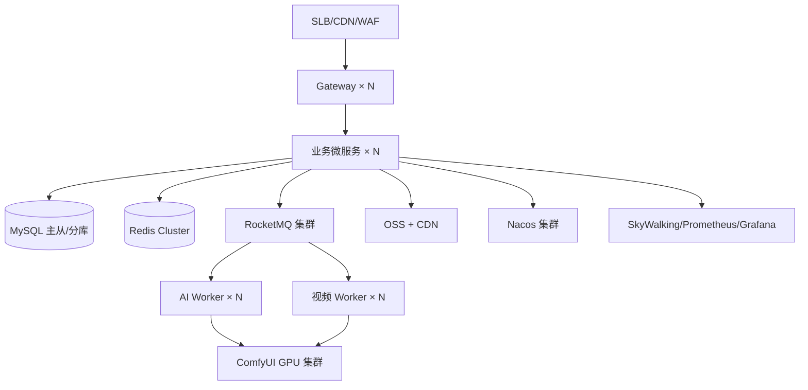

# 漫剧工场 REELMANGA · 开发架构文档（分布式微服务版）

> 技术栈：**Vue 3 + Spring Boot 3 + Spring Cloud Alibaba + Spring AI 2.0**
> 架构形态：**分布式微服务 + DDD 领域驱动设计**
> 范围：覆盖 `index.html`（前台）与 `admin.html`（后台）全部功能，面向可商用的生产级实现，支持 500 / 3000 / 5000 同时在线。
> 版本：v2.0

---

## 目录

1. [项目概述](#1-项目概述)
2. [功能范围](#2-功能范围)
3. [技术选型](#3-技术选型)
4. [总体架构（分布式）](#4-总体架构分布式)
5. [领域划分与服务清单](#5-领域划分与服务清单)
6. [前端架构](#6-前端架构)
7. [后端架构（DDD）](#7-后端架构ddd)
8. [核心模块详细设计](#8-核心模块详细设计)
9. [数据库与数据治理](#9-数据库与数据治理)
10. [接口与通信规范](#10-接口与通信规范)
11. [分布式治理](#11-分布式治理)
12. [容量规划与服务器配置](#12-容量规划与服务器配置)
13. [安全设计](#13-安全设计)
14. [可观测性](#14-可观测性)
15. [部署方案与 CI/CD](#15-部署方案与-cicd)
16. [开发里程碑与排期](#16-开发里程碑与排期)
17. [风险与应对](#17-风险与应对)
18. [附录](#18-附录)

---

## 1. 项目概述

「漫剧工场 REELMANGA」是一款 **AI 一键生成短剧** 的 SaaS 平台，支持 **真人短剧 / 漫剧 / 动漫 / 图文动态** 多种成片形态，画幅比例可配置（16:9 / 9:16 / 3:4 / 21:9 / 1:1 / 4:3）。用户写/导入剧本，经多 Agent 质检定稿、生成视频提示词、生成人物/场景、配音合成，产出可发布短剧，并支持多平台分发与变现。

核心商业闭环：**创意 → 无感生成 → 发布 → 变现**。

### 1.1 架构目标

| 维度 | 目标 |
|------|------|
| 商用 | 多租户、按量计费、API Key/自部署服务私有化、内容合规、多形态、多画幅 |
| 可用性 | 核心链路 ≥ 99.9%，服务无单点，可灰度、可回滚 |
| 性能 | 业务接口 P95 < 200ms；AI 生成异步不阻塞请求 |
| 扩展 | 500 → 5000 在线按服务独立扩容；生成 Worker 按 GPU/配额弹性伸缩 |
| 可维护 | DDD 领域边界清晰，服务自治，统一可观测 |

---

## 2. 功能范围

### 2.1 前台（对应 index.html）

| 模块 | 功能 |
|------|------|
| 账号 | 注册/登录/第三方登录/会话持久化 |
| 项目中心 | 项目 CRUD、状态流转 |
| 创作台 | 剧本写作/导入 → 多 Agent 质检 → 定稿 → 提示词 → 校验 → 人物/场景 → 分镜台（**画幅可配置**） |
| 模型服务 | 供应商预设、能力矩阵、能力路由、**自部署 ComfyUI 关联**、连通测试、Key 打码 |
| 作品库 | 列表/筛选/播放器 |
| 数据看板 | 播放、收益、粉丝、平台分发 |
| 实时热点 | 抖音/微博热榜、1 小时更新、近 3 小时最高热度、一键造梗 |
| 其它 | 风格引擎、定价 |

### 2.2 后台（对应 admin.html）

仪表盘、用户管理、作品审核、评论管理、订单管理、模型服务、数据统计、角色权限、系统设置、操作日志、登录屏。

### 2.3 成片形态与画幅（可配置）

| 成片形态 | 说明 | 典型画幅 |
|---------|------|---------|
| 真人短剧 | AI 数字人 / 真人实拍 + AI 后期 | 9:16 / 16:9 |
| 漫剧 | 漫画分镜动态化 + 配音 | 9:16 / 3:4 |
| 动漫 | 2D / 3D 动画短片 | 16:9 / 21:9 |
| 图文动态 | 图片 + 文字 + 配音轮播 | 3:4 / 1:1 |

画幅枚举：`16:9 / 9:16 / 3:4 / 21:9 / 1:1 / 4:3`。画幅为项目级配置，贯穿构图 → 生图/生视频 → 画布 → 导出 → 发布。

---

## 3. 技术选型

| 层 | 选型 | 说明 |
|----|------|------|
| 语言 | Java 21 / TypeScript 5 | LTS |
| 后端框架 | Spring Boot 3.4.x | 与 Spring AI 2.0 配套 |
| AI 框架 | Spring AI 2.0.x | Chat/Image/Audio 抽象 + 自定义 base-url |
| 微服务 | Spring Cloud Alibaba 2023.x | Nacos / Gateway / OpenFeign / Sentinel / Seata |
| 服务发现/配置 | Nacos | 注册中心 + 配置中心 |
| 网关 | Spring Cloud Gateway | 鉴权/限流/路由/灰度 |
| 远程调用 | OpenFeign | 服务间 REST |
| 熔断限流 | Sentinel | 网关 + 服务 + 供应商三级限流 |
| 分布式事务 | Seata | AT / TCC |
| 消息 | RocketMQ 5.x | 异步任务、事务消息、延迟消息 |
| 分布式任务 | XXL-Job | 定时任务（热点同步/结算） |
| 持久层 | MyBatis-Plus 3.5.x | CRUD |
| 数据库 | MySQL 8.0 + ShardingSphere 5.x | 分库分表 + 多租户 |
| 缓存 | Redis 7.x（Redisson） | 会话/热点/榜单/分布式锁 |
| 对象存储 | MinIO / 阿里云 OSS | 素材/成片 |
| Web | Vue 3.5 + Vite + Pinia + Router + Element Plus + ECharts | 前台/后台 |
| 容器 | Docker + K8s | 编排 |
| 可观测 | SkyWalking + Prometheus + Grafana + Loki | 链路/指标/日志 |
| 安全 | Spring Security + JWT | 认证授权 |

> **为何 Spring AI 2.0**：多供应商 Chat/Image/Audio 抽象 + 自定义 base-url，天然兼容「中转站 / OpenAI 兼容」；生视频无官方抽象，自定义 `VideoClient`。**自部署 ComfyUI** 通过 HTTP API 接入（见 8.2）。

---

## 4. 总体架构（分布式）



**设计原则**
- **领域自治**：每个服务拥有独立边界上下文与私有数据，通过 REST(Feign) 同步调用、MQ 异步解耦。
- **生成链路异步化**：`pipeline-service` 编排任务，投递 MQ 由 Worker 执行，前端 SSE 推进度（用户无感）。
- **AI 网关收敛供应商**：所有模型调用统一经 `ai-provider-service`，统一路由/限流/计量/密钥/ComfyUI 工作流。
- **合并部署策略**：逻辑上 10 个服务，MVP 可合并为 4~6 个 JVM 部署（如 user+admin、content+analytics），随规模独立拆出，避免“过度微服务”。

---

## 5. 领域划分与服务清单

| 领域 | 服务 | 职责 | 核心表 | 依赖 |
|------|------|------|--------|------|
| 用户域 | user-service | 注册/登录/第三方、RBAC、会员 | user, role, permission, user_role | Redis |
| 创作域 | project-service | 项目、剧本、分镜、素材 | project, script, shot, asset | OSS, ai-provider |
| AI 编排域 | pipeline-service | 多 Agent 编排、任务状态机、提示词模板 | agent_task, agent_task_step | ai-provider, RocketMQ |
| AI 网关域 | ai-provider-service | 供应商抽象、能力路由、Key 加密、用量计量、**ComfyUI 工作流** | model_provider, model_route, api_usage | Spring AI, ComfyUI |
| 生成执行域 | image/video/tts-worker | 生图/生视频/配音执行 | (消费 task) | ai-provider, OSS |
| 内容域 | content-service | 作品、评论、审核、实时热点 | work, comment, hot_trend | RocketMQ, Redis |
| 交易域 | trade-service | 订单、支付、退款、计费 | order, payment | 支付渠道 |
| 数据域 | analytics-service | 统计、看板、报表 | 统计表 | 定时任务 |
| 运营域 | admin-service | 后台接口、操作日志、系统设置 | operation_log | user-service |

**服务间通信约定**
- 同步：OpenFeign + 统一 `R<T>` 响应；跨服务调用带 `traceId`、`userId` 透传。
- 异步：RocketMQ Topic 约定（`gen.task.submit`、`gen.task.done`、`trade.order.paid`…）。
- 数据归属：禁止跨库 Join；需要他人数据走接口或本地冗余/事件副本。

---

## 6. 前端架构

```
web/
├── src/
│   ├── router/            # 前台 + 后台路由（懒加载）
│   ├── stores/            # Pinia: auth/project/pipeline/models/trends
│   ├── api/               # axios 封装 + 各域接口模块
│   ├── components/        # ReelCard/FramePlayer/AgentCard/ComfyUIFlow...
│   ├── views/front|admin  # 页面
│   ├── composables/       # useSSE/useCountdown/usePolling
│   └── styles/            # 设计令牌
```

- 页面→路由映射与原型一致（前台 `/`、`/studio/:id`、`/models`…；后台 `/admin/**`）。
- 实时：创作台进度用 **SSE**，热榜轮询 60s。
- 播放器/分镜：多画幅帧渲染（9:16/16:9/3:4/21:9/1:1 可配置）。

---

## 7. 后端架构（DDD）

每个服务采用统一 DDD 分层（以 pipeline-service 为例）：

```
com.reelmanga.pipeline
├── interfaces/     # controller、dto、消息监听
├── application/    # 应用服务、编排 PipelineService
├── domain/         # 聚合根 Task/Stage/Agent、领域事件
├── infrastructure/ # repository、MQ、AI 客户端
└── config/         # 线程池、重试、Sentinel
```

**关键约定**
- 聚合根控制事务边界；领域事件驱动跨服务协作（如“任务完成”事件 → content-service 生成作品）。
- 接口层薄，业务在 application/domain；`infrastructure` 可替换（如换供应商、换 MQ）。
- 统一异常码 + 统一 `R<T>` 响应 + `traceId`。

---

## 8. 核心模块详细设计

### 8.1 认证与权限（RBAC）

- JWT（access 30min + refresh 7d），Redis 存刷新令牌；第三方登录（微信/手机/Apple/Google）。
- `user → role → permission`，`@PreAuthorize("hasAuthority('work:review')")`。
- 后台独立 RBAC，对应 admin.html 角色权限页；验证码/限流防刷。

### 8.2 模型服务与能力路由（含 ComfyUI 自部署）

**供应商类型（provider_type）**

| 类型 | 说明 | 认证 |
|------|------|------|
| `official` | DeepSeek/OpenAI/Claude/Gemini/通义/智谱/MiniMax/可灵/即梦 | API Key |
| `relay` | 中转站 / OpenAI 兼容 | base_url + Key |
| `selfhosted` | **自部署 ComfyUI**（生图/生视频） | 服务地址（可无 Key） |

**ComfyUI 关联设计**

```
ComfyUI 实例 <--HTTP--> ai-provider-service <--Feign/MQ--> 生成 Worker
   /prompt  提交工作流(JSON API 格式)
   /history 查询结果
   /ws      进度推送
   /upload  上传参考图(图生图/视频)
```

- **工作流模板**：把 ComfyUI workflow（API 格式 JSON）存为模板，参数化 `{positive, negative, seed, width, height, model, lora, steps, cfg}`；`width/height` 由 `aspect_ratio` 计算（如 9:16→576×1024、16:9→1024×576）。
- **生图**：文生图 / 图生图工作流；**生视频**：AnimateDiff / SVD / 视频工作流（依赖 ComfyUI 对应 custom nodes）。
- **多实例负载**：`model_provider` 支持配置多个 ComfyUI 地址，Worker 按队列深度/健康状态轮询或由 K8s 对外暴露统一入口；GPU 不足时排队。
- **能力矩阵**：ComfyUI 能力标记 `image=true, video=true(取决于安装节点), llm=false, tts=false`。
- **安全**：自部署地址仅服务端可见；通过内网/专线访问，公网暴露需加鉴权反代。

**能力路由（AiGateway 抽象）**

```java
public interface AiGateway {
    String chat(RouteKey route, ChatRequest req);
    String image(RouteKey route, ImageRequest req);
    String tts(RouteKey route, TtsRequest req);
    VideoTask video(RouteKey route, VideoRequest req);
}
```

- `RouteKey = (userId, capability)`：优先用户私有配置，否则平台默认路由（后台可设）。
- 中转站走 `OpenAiChatModel(baseUrl=中转地址)`；云供应商走 Spring AI 各 starter。
- 连通测试：发极小请求校验 + 测延迟；用量写 `api_usage` 计费。

### 8.3 多 Agent 流水线（核心）

状态机：`PENDING → RUNNING → (阶段) SUCCESS/FAILED → PARTIAL(重跑) → DONE`。

- 编排：Stage 链 + 阶段内并行 Agent（`CompletableFuture`）。
- 结构化输出：Spring AI `BeanOutputConverter` + JSON Schema，返回 `{issues, fixedScript, score}`。
- 每步落库 `agent_task_step`（prompt/耗时/token/成本/状态），支撑“无感进度”。
- 重试 2 次 + 换模型降级；合规 Agent 失败阻断发布；`PARTIAL` 允许前端逐镜编辑重跑。
- **成片形态分流**：`content_type` 决定各阶段模型与风格（真人→数字人/实拍、漫剧→漫画分镜、动漫→动画），Stage 编排不变。

### 8.4 剧本 / 提示词 / 分镜

- 剧本：原文 + 定稿 + diff（JSON）。
- 提示词：逐镜生成，含画面/镜头/角色/情绪/时长。
- 提示词校验：一致性/风格/安全/可生成性四类。
- 分镜 `shot`：`scene_id/character_id/camera/emotion/duration/dialogue/prompt/aspect_ratio/content_type/asset_url`。

### 8.5 生图 / 生视频 / 配音

- 生图：`ImageModel` 或 ComfyUI 工作流，透传 `aspect_ratio` → 存 OSS → 回写。
- 生视频：`VideoClient`（云供应商「提交+轮询」/ ComfyUI「提交+轮询」），透传 `aspect_ratio`；成本高，走 MQ + 限流 + 优先级。
- 配音：`AudioModel` 或供应商 TTS → OSS → 回写。
- 成片形态适配：按 `content_type` 选模型与风格参数。

### 8.6 实时热点（抖音/微博）

`XXL-Job` 每小时拉取（三方数据服务）→ 清洗 → `hot_trend` → Redis 缓存；前端轮询 `/trends?window=3h`，只返回近 3 小时按热度排序前 N。一键造梗写入项目灵感。

### 8.7 作品 / 发布 / 数据

- 审核状态机：`审核中 → 已上架/已下架/违规下架`，人工 + 合规 Agent。
- 发布：`PublishChannel` 接口，按平台偏好适配画幅（抖音 9:16、B站/西瓜 16:9）。
- 数据看板：离线统计 + ECharts，避免大表实时聚合。

### 8.8 后台管理

独立路由 + RBAC，`/admin/**`，对应 admin.html 十个模块。

---

## 9. 数据库与数据治理

核心表（同 v1，已含 `aspect_ratio/content_type`）：

| 表 | 关键字段 |
|----|---------|
| `user` / `role` / `permission` / `user_role` / `role_permission` | 账号/RBAC |
| `project` / `script` / `shot` / `asset` | 项目/剧本/分镜/素材 |
| `agent_task` / `agent_task_step` | 流水线任务与步骤 |
| `model_provider` / `model_route` / `api_usage` | 供应商(含 ComfyUI)/路由/用量 |
| `work` / `comment` / `hot_trend` | 作品/评论/热点 |
| `order` / `payment` | 订单 |
| `operation_log` | 审计 |

**分布式数据治理**
- **分库分表**：ShardingSphere，分片键 `user_id`（多租户隔离 + 水平扩展）。
- **多租户**：SQL 拦截器强制注入 `user_id`/`tenant_id` 过滤。
- **跨服务数据**：禁止跨库 Join；用接口、事件副本、或冗余字段。
- **一致性**：Seata AT 保证订单-账户等强一致；生成链路用最终一致（事件 + 补偿）。

---

## 10. 接口与通信规范

- REST + 统一 `R<T>{code,message,data,traceId}`；分页 `page/size`。
- 异步：`POST /api/tasks` → `taskId`；`GET /tasks/{id}`；`SSE /tasks/{id}/stream`。
- 服务间：Feign 同步 + MQ 异步（Topic 约定）。
- 幂等：`Idempotency-Key`（任务/订单提交）。
- 错误码分段：1xxx 通用、2xxx 用户、3xxx 项目、4xxx 模型、5xxx 订单。

---

## 11. 分布式治理

| 关注点 | 方案 |
|--------|------|
| 服务发现/配置 | Nacos（配置灰度、动态刷新） |
| 网关 | Gateway 统一鉴权/限流/路由/灰度/黑白名单 |
| 熔断降级 | Sentinel（服务级 + 供应商级 + 用户级限流） |
| 分布式事务 | Seata AT/TCC（交易）；事件最终一致（生成链路） |
| 分布式锁 | Redisson（幂等、防重复提交、任务抢占） |
| 分布式任务 | XXL-Job（热点同步、账单、离线统计） |
| 链路追踪 | SkyWalking + `traceId` 全链路透传 |
| 消息可靠性 | RocketMQ 持久化 + 死信 + 重试 + 事务消息 |

---

## 12. 容量规划与服务器配置

> 在线 ≠ 并发；AI 生成异步走队列；成本大头是 AI 上游调用（变量成本）。

| 指标 | 500 在线 | 3000 在线 | 5000 在线 |
|------|----------|-----------|-----------|
| 业务峰值 QPS | 50–100 | 300–500 | 500–1000 |
| WebSocket | 500 | 3000 | 5000 |
| 应用服务（各微服务合计） | 4C8G × 2~3 | 4C8G × 5~6 | 8C16G × 6~8（K8s HPA） |
| MySQL | 4C8G 主从 | 8C16G 主从+分库 | 8C16G×2 主从 + 分库分表 |
| Redis | 4C8G | 4C8G 主从 | Cluster 3主3从 |
| RocketMQ | 4C8G×1 | 4C8G×1 | 4C8G×3 集群 |
| Nacos | 2C4G×1 | 2C4G×1 | 2C4G×3 集群 |
| AI Worker | 2–4 | 4–8 | 8–16（按 GPU/配额） |
| **自部署 ComfyUI（GPU）** | 1×T4/L4 | 2×L4/A10 | 4×A10/A100（分图/视频队列） |
| 对象存储+CDN | OSS | OSS | OSS+CDN |
| 带宽 | 5–10 Mbps | 20–30 Mbps | 50–100 Mbps + CDN |
| 月成本（云） | ¥800–1500 | ¥5000–9000 | ¥1.2万–2.5万（不含 GPU/AI 上游） |

**GPU 说明**：自部署 ComfyUI 是可选方案——小规模用云生图/生视频 API 更省心；规模上来后用自建 GPU 摊薄成本。生视频最吃 GPU，建议独立队列与机型。

---

## 13. 安全设计

- 密钥：API Key AES-GCM + KMS；ComfyUI 地址仅服务端可见，内网/专线访问。
- 认证：JWT + 刷新令牌；后台二次验证。
- 内容合规：文本/图片前置审核（合规 Agent + 三方内容安全）。
- 接口：HTTPS、限流、幂等、防重放、CORS 白名单。
- 多租户：SQL 拦截强制 `user_id` 过滤；审计全量留痕。

---

## 14. 可观测性

- 指标：Micrometer → Prometheus → Grafana（QPS/延迟/错误率/JVM/连接池/GPU 利用率）。
- 日志：结构化 JSON → Loki，带 `traceId`。
- 链路：SkyWalking 覆盖跨服务调用 + Agent 阶段耗时。
- 告警：错误率、P95、MQ 积压、供应商失败率、ComfyUI 队列深度、任务成本异常。

---

## 15. 部署方案与 CI/CD



- 环境：dev（Compose）/ test / staging（真实供应商低配额）/ prod（多可用区）。
- 发布：Git push → CI（构建/单测/镜像）→ 镜像仓库 → CD（灰度 10% → 全量）→ 监控 → 回滚。
- 前端：构建产物 OSS+CDN；数据库 Flyway 向后兼容迁移。

---

## 16. 开发里程碑与排期

> 4 后端 + 2 前端，MVP 约 **10–12 周**。

| 阶段 | 内容 | 周期 |
|------|------|------|
| P0 初始化 | 脚手架、Nacos/Gateway/CI、DDD 骨架、Flyway | 1 周 |
| P1 账号与 AI 网关 | 登录/RBAC、供应商/路由/Key 加密/**ComfyUI 接入** | 2 周 |
| P2 项目与流水线 | 剧本/多 Agent/提示词/分镜 | 3 周 |
| P3 生成任务 | 生图/生视频/配音 Worker、进度推送 | 2 周 |
| P4 前台其余 | 作品库/数据/热点/定价 | 2 周 |
| P5 后台 | 十个后台模块 | 2 周 |
| P6 测试上线 | 压测/安全/灰度上线 | 2 周 |

验收：5000 在线压测 P95<200ms、错误率<0.1%、AI 任务 24h 无积压、跨服务链路无断点。

---

## 17. 风险与应对

| 风险 | 应对 |
|------|------|
| 微服务复杂度/分布式事务 | 合并部署起步、Seata 仅用于交易、生成链路最终一致 |
| AI 供应商限流/涨价 | 多供应商路由 + 中转站 + **自部署 ComfyUI 兜底** |
| 生视频成本/GPU 紧张 | 优先级队列、套餐限并发、短视频切片、自建 GPU 分期投入 |
| ComfyUI 工作流兼容 | 模板版本化 + 校验；自定义节点按需装；灰度切换 |
| 热榜数据合规 | 接三方授权数据服务 |
| 内容违规 | 合规 Agent + 三方内容安全 + 人工复核 |
| 单点故障 | 云高可用组件 + 多可用区 + 无状态应用 |

---

## 18. 附录

### 18.1 关键依赖（后端）

```
spring-boot-starter-web/security/validation/data-redis
spring-cloud-starter-alibaba-nacos-discovery / nacos-config
spring-cloud-starter-gateway / openfeign / loadbalancer
spring-cloud-starter-alibaba-sentinel / seata
rocketmq-spring-boot-starter
spring-ai-starter-model-openai / anthropic / google / dashscope / zhipuai / minimax
mybatis-plus-spring-boot3-starter / shardingsphere-jdbc
mysql-connector-j / redisson / minio / jjwt / flyway
micrometer-registry-prometheus / skywalking
xxl-job-core
```

### 18.2 环境变量示例

```env
NACOS_ADDR=... NACOS_NAMESPACE=prod
DB_HOST=... REDIS_HOST=... MQ_NAMESERVER=...
OSS_ENDPOINT=... OSS_AK=... OSS_SK=...
AI_DEFAULT_PROVIDER=deepseek
AI_KEY_DEEPSEEK=... AI_KEY_OPENAI=... AI_KEY_KLING=...
# 自部署 ComfyUI
COMFYUI_ENDPOINTS=http://10.0.0.11:8188,http://10.0.0.12:8188
COMFYUI_WORKFLOW_T2I=comfy/t2i.json
COMFYUI_WORKFLOW_VIDEO=comfy/video.json
JWT_SECRET=... AES_KEY=...
```

---

> **一句话总结**：采用 **DDD 微服务 + Spring Cloud Alibaba + RocketMQ 异步 Worker + AI 网关** 的分布式架构，把「能力路由 + 限流 + 计量」做成核心，并支持 **云供应商与自部署 ComfyUI** 双轨；逻辑边界清晰、可合并部署起步、按服务独立扩容，从 500 人平滑扩到 5000 人在线。
